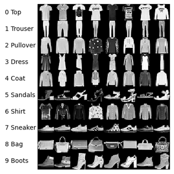
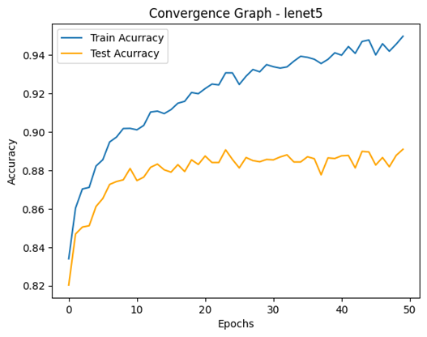
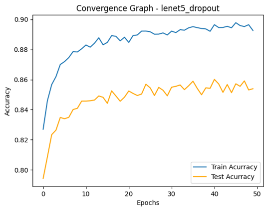
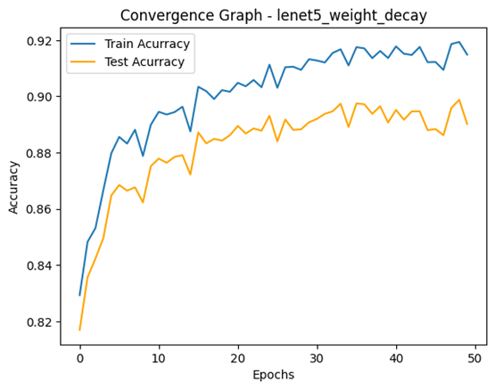
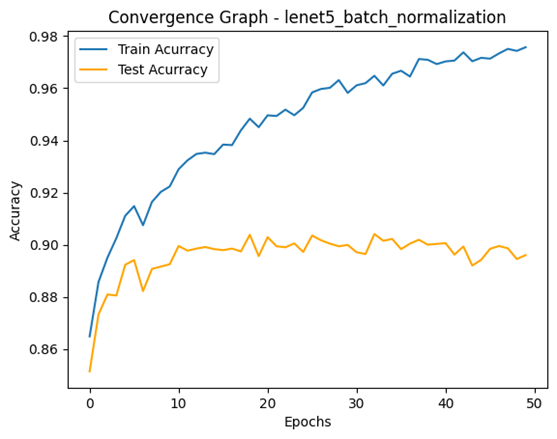
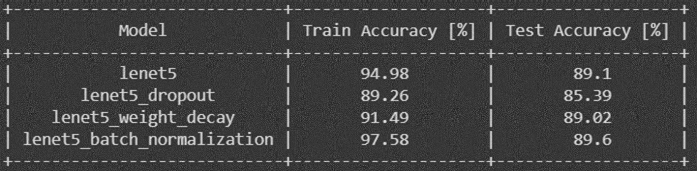

  <h1 align="center">LeNet5 over FashionMNIST/MNIST Regularization Techniques Comparison</h1>

## Data

The data we use for this exercise is Fashion-MNIST, a dataset of Zalando’s article images—
consisting of a training set of 60,000 examples and a test set of 10,000 examples. Each
example is a 28x28 grayscale image, associated with a label from 10 classes.

  

## Model

LeNet is a convolutional neural network structure proposed by LeCun et al. in 1998.[1] In general, LeNet refers to LeNet-5 and is a simple convolutional neural network. (Wikipedia)

### Baseline model – LeNet5:

| Layer (type) | Output Shape     | Param #              |
|--------------|------------------|----------------------|
| Conv2d       | [-1, 6, 28, 28]  | 156                  |
| Tanh         | [-1, 6, 28, 28]  | 0                    |
| AvgPool2d    | [-1, 6, 14, 14]  | 0                    |
| Conv2d       | [-1, 16, 10, 10] | 2,416                |
| Tanh         | [-1, 16, 10, 10] | 0                    |
| AvgPool2d    | [-1, 16, 5, 5]   | 0                    |
| Conv2d       | [-1, 120, 1, 1]  | 48,120               |
| Flatten      | [-1, 120]        | 0                    |
| Linear       | [-1, 84]         | 10,164               |
| Tanh         | [-1, 84]         | 0                    |
| Linear       | [-1, 10]         | 850                  |
|              |                  | Total params: 61,706 |

### Techniques to compare:
* Dropout
* Weight Decay
* Batch Normalization

## Results
### LeNet5 (Baseline)

  

### LeNet5 with Dropout

  

### LeNet5 with Weight Decay

  

### LeNet5 with Batch Normalization

  

## Summary of all accuracies

  

## Conclusions

* We got the best accuracy with the Batch Normalization technique, both on Train and Test sets.
* The Train accuracy of the Batch Normalization technique is almost perfect and can get better with more epochs.
* We got the worst Accuracy with the Dropout technique, both on Train and Test sets. Even worse results compared to the Baseline model.
* We used the validation for fine tuning the general model. For example, to choose the optimizer and size of epochs.

